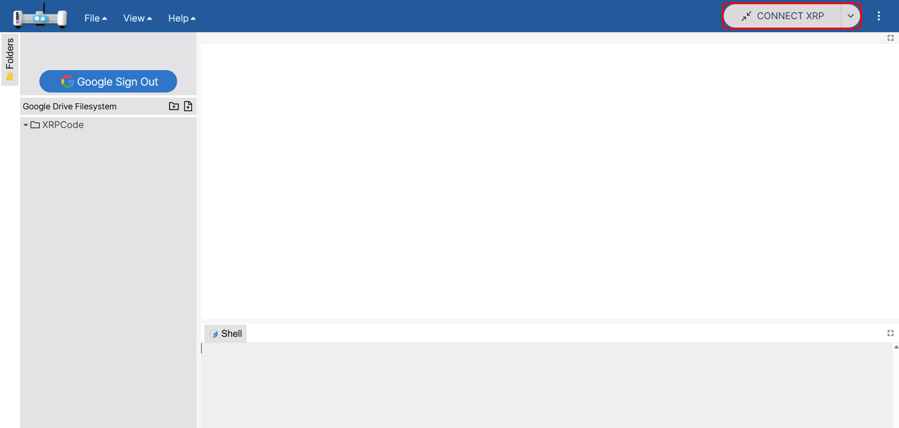

XRPCode V2 Integrated Development Environment
==========================================
XRPCode V2 is a web-based development tool that is run in either the Google Chrome or Microsoft Edge browsers.
XRPCode V2 can be used to create either Python or Blockly language programs that run natively on the XRP
control board. Blockly programs are first translated to Python and then run. In fact, you can view or
even translate the Blockly program into a Python program.

Run XRPCode V2 by navigating to `XRPCode V2 web site <https://XRPCode.wpi.edu/staging>`_. 

If this is your first time accessing XRPCode V2 or if there has been an update, a changelog will be displayed.
Read through the changelog to learn what is new in the current release of XRPLib or the editor.

New in XRPCode V2
------------------
XRPCode V2 has many new features that were not included in XRPCode V1.

    * New web architecture
    * Light and dark theme support
    * Language support (English and Spanish, with more on the way)
    * Dashboard for viewing sensors on the XRP
    * New firmware loader
    * Driver support for QWIIC connected devices
    * Monaco Editor for Python (the same editor as VS Code)
    * Google Drive support for storing and working files
    * Backup and restore functions (to Google Drive)

Exploring the XRPCode V2 user interface
------------------------------------

.. image:: images/XRPCodeV2_Windows.png
    :width: 600

There are 3 major window areas for XRPCode V2.

On the left (1) is the Filesystem window. This will show the files on your XRP whenever an XRP is connected or
in your XRPCode Google Drive folder if you have connected to Google Drive. 

In the middle (2) is the editor. This is where you will be working on your programs.

At the bottom (3) is the shell window. This is where print statement output will be displayed. 
You can also use the shell as a command line to write Python code as an interactive way to quickly test ideas.

Connecting your XRP to your Computer
------------------------------
The XRP robot has a USB-C connector or a micro-USB connector (for the beta version of the XRP) on the controller board that is connected to your computer's
USB port with a cable.

.. warning:: 
    Many USB cables are for power only and do not transmit data. You will need a USB cable that can
    transfer data and power. 

Connecting XRPCode V2 to the XRP
---------------------------
To establish the connection between the XRP robot and the computer, press the 'CONNECT XRP' button. 

Once a connection has been made, further connections will happen automatically when the XRP is plugged in and XRPCode V2 is started.

This will bring up a dialog that lets you select Bluetooth or USB for connecting to the XRP.
Select your desired connection method.

.. image:: images/XRPCodeV2_Connecting_2.png
    :width: 400

Select your XRP from the options available if prompted.

When the connection is made, the 'CONNECT XRP' button will change to a green 'RUN' button indicating that
the connection has been made and a program can be run. The Filesystem
window will show the files on the connected XRP.

When connected to the XRP via USB, a 'Switch to Bluetooth' button will appear at the top of your screen.
Selecting this button will connect your XRP to XRPCode V2 via Bluetooth. Follow the instructions on the screen.
Once you have connected to your XRP via Bluetooth, XRPCode V2 will remember your XRP and you can automatically 
connect to it again via Bluetooth in the future.

If XRPCode V2 cannot find your serial connection, or there are other connection issues please refer to
the troubleshooting section at the bottom of this page.

Connecting to Google Drive
--------------------------
At the top of the Filesystem window is a 'Google Sign In' button. Clicking this button will open a pop out window
prompting you to select a Google account to sign in. By signing in to Google, files can be saved to Google Drive
for access even when the XRP is not connected to XRPCode V2.

.. warning:: 
    When signed in to Google, only files saved to Google Drive will be accessible in the Filesystem window.

Using XRPCode V2
-------------
Now that the robot is connected, this is a good time to write a short program to learn about the editor.

In the menu bar, under the 'File' menu, click on 'New File' and select 'Blockly File' as the file type. Then give your file a name, such as 'First Program'.
Click 'Submit' when you are finished to create your new file.

On the left of the editor is a palette
of all the available blocks. 

.. image:: images/XRPCodeV2_Blockly_Palette.png
    :width: 600

Notice that they are grouped by function. We recommend you click through
each section to get a sense of what blocks are in each group.

In this example, we'll create a program that will turn a controller board LED on and print a message in
the XRPCode V2 shell window at the bottom of the screen.

.. |ico2| image:: images/led_on.png
    :height: 3ex

.. |ico4| image:: images/print.png
    :height: 3ex

Click on the "Control Board" tab and then click on the |ico2| block. This will place this block onto your working 
canvas. You can move the block around and place it where you like. Now click on the "Text" tab. Then select the 
first block |ico4|. This block is now also on your canvas. You can move this block around and place it right under 
the |ico2| block. You will notice that as you get close to the bottom of the |ico2| block it will show a yellow line 
indicating that the two fit together. When you let go of the |ico4| block it should click together with the |ico2| 
block. Feel free to change the "abc" to say what you want to print; ideally something useful to the program. For 
example, you might print something like "The LED is now on".

Under the 'File' menu select 'Save File' to save this new program. 

.. image:: images/XRPCodeV2_Save_File.png
    :width: 600

The program has now been saved. You will see the name of your program in the Filesystem window on the left. 

You can now press on the green 'RUN' button, to run this program. If your XRP is not turned on, a warning will pop up 
telling you to turn on the power switch. If this happens, flip the power switch on your XRP to 'on' and then click 'OK'.

You will notice a few things:
    * The green LED next to where the USB cable connects to on the XRP will go on for a little while and then turn back off.
    * The shell window at the bottom of XRPCode V2 will print out your message from the print statement.

You may have also noticed that the green 'RUN' button changed to a red 'STOP' button while your program was running and 
then turn back after.

Clicking on the 'STOP' button will interrupt the program.

You might have noticed that the robot turns off when the program finishes or is interrupted. This is so that at the end 
of each run, the XRP is reset to a known state in preparation for the next time a program is started.

The 'View' menu contents change depending on the language you are using. For Blockly it will show View
options for a Blockly program. Click on 'View' and then on 'View Python'. This will bring up a view of the Python code 
that is generated from your Blockly file. Let's actually convert this Blockly program program into a Python program. 
Click on 'View' and then on Convert to 'Python'.

.. image:: images/XRPCodeV2_Convert_To_Python.png
    :width: 600

XRPCode V2 will first give you a warning to make sure you want to convert the program as this cannot be undone. Click 
'OK'. It will do the operation and you should notice two things have happened:

#. There is a new 'trash' directory on your XRP.

#. Your program name now ends in .py instead of .blocks. 

If you now go to the 'View' menu you will notice that the menu items have changed to be specific to Python. 

.. image:: images/XRPCodeV2_Python_View.png
    :width: 300

Close the 'View' menu and find the print statement in the program; it should be the last line. Change the message 
that is between the quotes. If you look at the file name tab at the top of the editor you will notice a white dot 
at the end of the name. That means that this file has been modified and has not yet been saved. Now if you click on 
the 'RUN' button it will save your program and run it again. The message in the shell window should be your new message. 

You can close a file by clicking on the X next to the file name at the top of the editor. If you want to open the 
program again you can double click on the file name in the Filesystem window.

Congratulations, you have now learned how to create and run programs in XRPCode V2! 

Using the Filesystem
----------------------
At the top of the filesystem are two buttons. The first, 'New Folder', will create a new folder and prompt you for
a folder name. The second, 'New File', will create a new file and prompt you for a file type and file name. 

Each folder and file in the filesystem will have two more buttons when hovered. The first, 'Rename', lets you rename
your file. The second, 'Delete', will delete your file. Note that deleting a file is permanent and cannot be undone, 
so make sure you really want to delete your file before doing so.

.. image:: images/XRPCodeV2_Filesystem.png
    :width: 300

Advanced Features
--------------------
The 3-dot menu in the top right of XRPCode V2 contains more advanced features. 

.. image:: images/XRPCodeV2_Advanced_Features.png
    :width: 300

| **Dashboard**
| The 'Dashboard' menu can be used to view sensor readings from the XRP when XRPCode V2 is connected to the XRP and the XRP 
| is running a program that starts the Dashboard. See the Dashboard blocks.

| **Drivers**
| Drivers for devices connected to the XRP through the QWIIC connector can be easily installed through the 'Drivers' menu.

| **Firmware Loader**
| XRPCode V2 contains 'Firmware Loader' menu for loading firmware onto the XRP.

| **Backup and Restore**
| Files stored on the XRP can be backed up to Google Drive, and restored to the XRP from Google Drive.

| **Settings**
| The settings menu has options for language selection and a light or dark theme. Currently the only supported languages are English and Spanish.

Troubleshooting XRPCode V2 connection issues
-----------------------------------------
**Cannot see the serial port when connecting**

    * Be sure that the USB cable is a data cable and not just a power cable.

    * Unplug the XRP from the computer and check the connection of the cable on the XRP side.

    * Toggle the power switch on the XRP off. Confirm that the sys LED is on. This means it is properly receiving power from the USB cable. 
      If the LED is not on, try a different cable.

    * Make sure you are running either Google Chrome or Microsoft Edge browsers. At the time of writing,
      only those browsers support serial communication required for programming the XRP.

**XRP was previously used for WPILib or some other purpose**

    * Use the Fimware Loader in the Advanced menu. Select the correct board type and Micropython. Then just follow the instructions.
